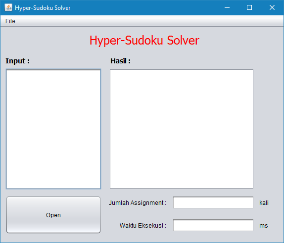
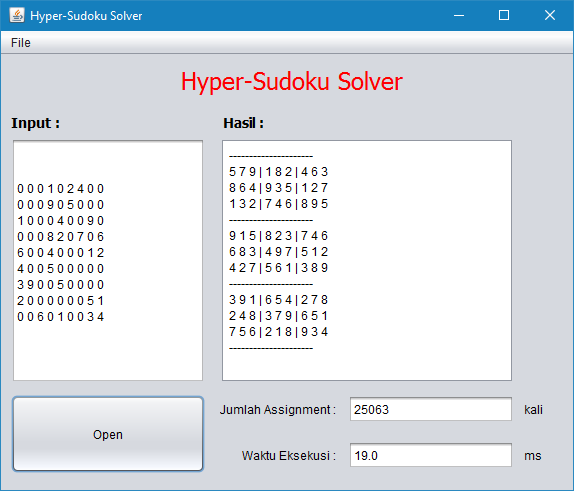

# Hyperdoku-Solver

Hyperdoku solver is application to solve hyperdoku. This application is to implement **Brute Force Algorithm**.

In this repository have two version application,

1. CLI (Command Line Interface) - is [here](CLI/).
2. GUI (Graphical User Interface) - is [here](GUI/).

* GUI version build with Netbeans.
* Test case is [here](test/).

## Interface

### GUI Version

#### Main Menu

#### Result

# Creator

Created by : Bervianto Leo Pratama
